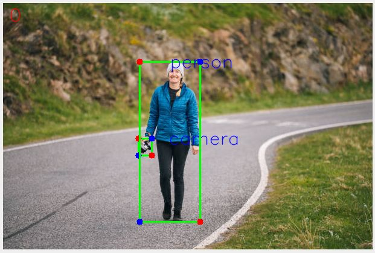

# Annotation Tool
* This annotation tool is for the annotation of dataset required by the object detection models.
* This tool gives the annotations in **COCO** format.
## Salient Features:
* Can draw bounding boxes from scratch for multiple objects in an frame and the box can be adjust.
* Can change the class of objects.
* An example shown in figure below:


# Installation
To use this tool first of all clone this repo and install all the dependencies defined in [requirements.txt](./requirements.txt).
```bash
git clone git@github.com:Mohanlal-11/Annotation_Tools.git
cd OD_Annotation_Tool
pip install -r requirements.txt
```

# Directory Format
* The images must be in placed in following format:
* First run the following command:
```bash
mkdir coco
```
The name of the main directory must be **coco** otherwise, it has to be change in conversion code too.
```plaintext
coco
├──folder1
|       ├── val2025
|               ├──img1.jpg
|               ├──img2.jpg
├──folder2
|       ├── val2025
|               ├──img1.jpg
|               ├──img2.jpg
```
* Then after the completion of annotations, the format of directory will be:
```plaintext
coco
├──folder1
|       ├── val2025
|       |       ├──img1.jpg
|       |       ├──img2.jpg
|       ├── annotations
|               ├── person_keypoints_val2025_kpts.json
├──folder2
|       ├── val2025
|       |       ├──img1.jpg
|       |       ├──img2.jpg
|       ├── annotations
|               ├── person_keypoints_val2025_kpts.json
```

# To Annotate images
* For the annotation of images, run the following command:
```bash
python3 bbox_annotation.py coco/folder1
```
* If you want to see an example, then run the following command:
```bash
python3 bbox_annotation.py coco/data/
```
# Point to be noted
* If you have multiple classes then first of all put your all class names into [classes.txt](./classes.txt) file.
* Manange the images in correct format as said in above **Directory Format**.
* If you have to draw the **small bbox inside of big bbox** then, **first draw the small bbox and then draw large bbox.**
* If you want to **change the class** of an object in an frame, then **click** inside the bbox and press **numbers i.e. 0 to number of classes** present in classes.txt.
* So if you press ***'1'*** then the class of the object will be the first name present in [classes.txt](./classes.txt), and so on.
* To move the bounding box from one place to other, click inside the box and then move.
* **You can draw multiple bboxes in an image/frame but if you want to do anything with any of the boxes, don't forget to click inside of that box.**


# Keyboard Shortcuts
| Keys  | Description                                                                                              |
| --------- | -------------------------------------------------------------------------------------------------------- |
| `m`       | saves the current annotation and moves to **next frame.**                                        |
| `n`       | saves the current annotation,  moves to the **previous frame** and shows the graph/keypoints.                                  |
| `./,`     | **jumps** to 10th frame from current frame. |
| `x`       | **jumps**  to random frame. |
| `q`       | saves the current annotation and **quits** the program. |
| `u`       | **jumps** to unannotated frame. |
| `p`       | **shows** the keypoints on object. |
| `d`       | **delets** the clicked bounding boxes. [**note:** To delete any drawn bbox, must click inside the bbox and press 'd'.] |
| `z`       | **undo** the last action. |
| `r`       | **restarts** the annotation from last save. |
| `0 to len(classes)`   | **changes** the class of clicked objects (to chage the class click inside of box and press any numeric key according to your classes placed in [classes.txt](./classes.txt)).

# Conversion
* If you want to convert the annotated dataset in **coco** format into **voc** format, then run the following command.
```bash 
python3 conversion_coco2voc.py --json_path /path/to/json/file/containing/main/directory
```
* **Example:**
```bash
python3 conversion_coco2voc.py --json_path coco
```

* If you want to convert the annotated dataset in **coco** format into **yolo** format, then run the following command.
```bash
python3 conversion_coco2yolo.py --json_path /path/to/json/file/containing/main/directory
```
* **Example:**
```bash
python3 conversion_coco2yolo.py --json_path coco
```


# Reference:
To make this tool as per our requirements, we took reference from a git repo: [PoseAnnotator](https://github.com/MiraPurkrabek/PoseAnnotator.git).